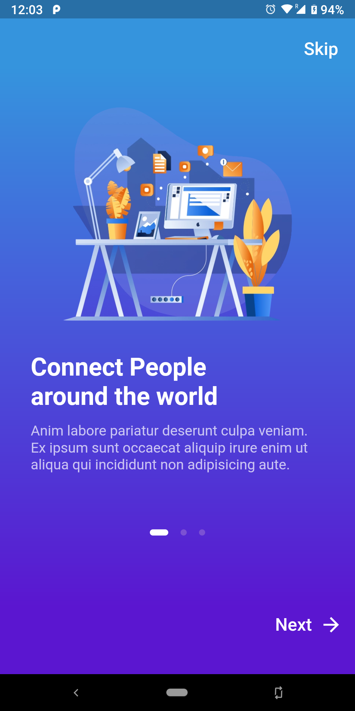
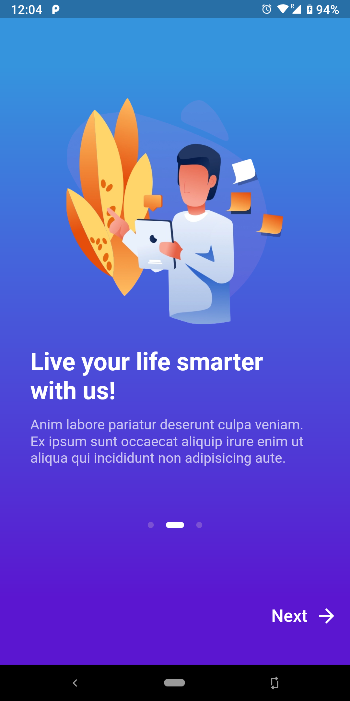
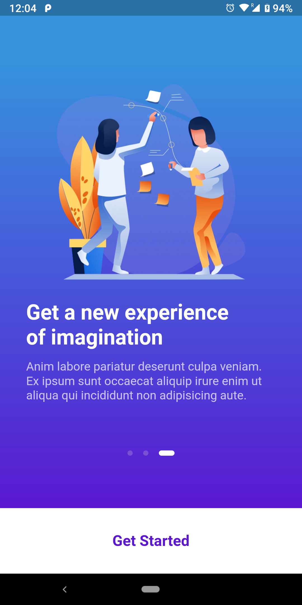

# Flutter Onboarding UI

onboarding ui created using flutter, design created by [Arek_k](https://dribbble.com/shots/5965530-Communities-checklists-App-Onboarding-UI) and thanks [marcus-ng](https://www.youtube.com/watch?v=8eRQyE2PN7w) for the tutorial.

## Download App

you can download the app from [here](https://github.com/muj-programmer/onboarding/releases)

## Screenshots

